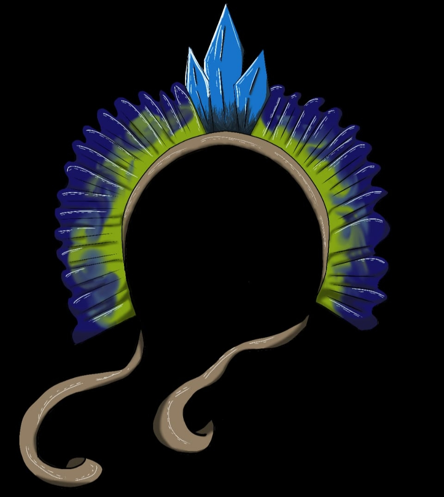

# 👋 Olá, eu sou Samuel Alves

### Mecatrônica • Software • Automação • Dados

Estudante de Mecatrônica na Escola Técnica Roberto Rocca, desenvolvendo projetos que conectam programação, automação e tecnologia para resolver problemas reais.

 

---

## 🛠️ Tecnologias

  

---

## 📊 Estatísticas

<table>
<tr>
<td width="50%" align="center">

</td>

<td width="50%" align="center">

</td>
</tr>
</table>

---

# 🚀 Projetos

<table>
<tr>

<td width="30%" valign="top">

<h3 align="center">🌧️ Projeto MAPE — Toró</h3>

  

Sistema desenvolvido para monitorar condições relacionadas a enchentes em Santa Cruz, combinando sensores físicos e dados externos para identificar possíveis situações de risco e emitir alertas.

  

  <a href="https://github.com/Samuel-Alves-dev/Projeto-MAPE-Toro.git"><b>🔗 Ver projeto</b></a>

</td>

<td width="30%" valign="top">

<h3 align="center">🦺 Controle de EPIs</h3>

  

Sistema desenvolvido para auxiliar na organização e gerenciamento dos Equipamentos de Proteção Individual utilizados na escola.

  

  <a href="https://github.com/Samuel-Alves-dev/EPI-Control.git"><b>🔗 Ver projeto</b></a>

</td>

</tr>

<tr>

<td width="30%" valign="top">

<h3 align="center">📚 StudyFlow</h3>

  

Plataforma criada para centralizar organização acadêmica, produtividade e acompanhamento das atividades estudantis.

  

  <a href="https://github.com/Samuel-Alves-dev/StudyFlow.git"><b>🔗 Ver projeto</b></a>

</td>

<td width="30%" valign="top">

<h3 align="center">💰 Meu Patrimônio</h3>

  

Sistema para organização financeira e acompanhamento de patrimônio, movimentações e informações financeiras.

  

  <a href="LINK_DO_PROJETO"><b>🔗 Ver projeto</b></a>

</td>

</tr>
</table>
